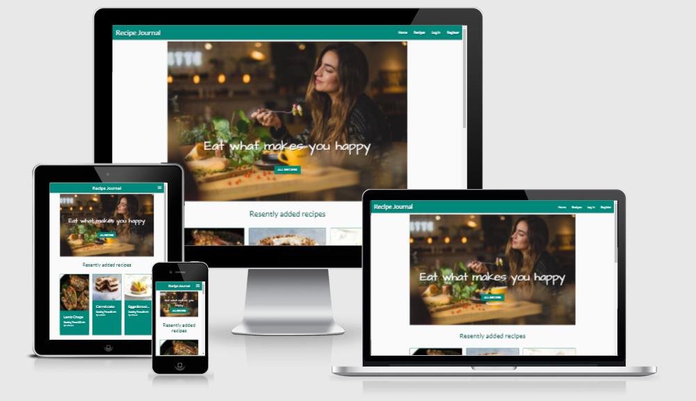
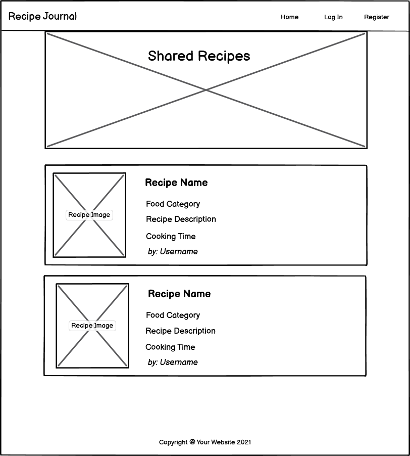
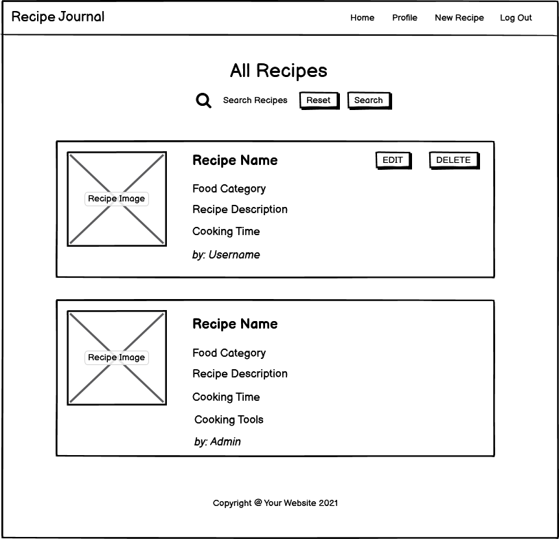
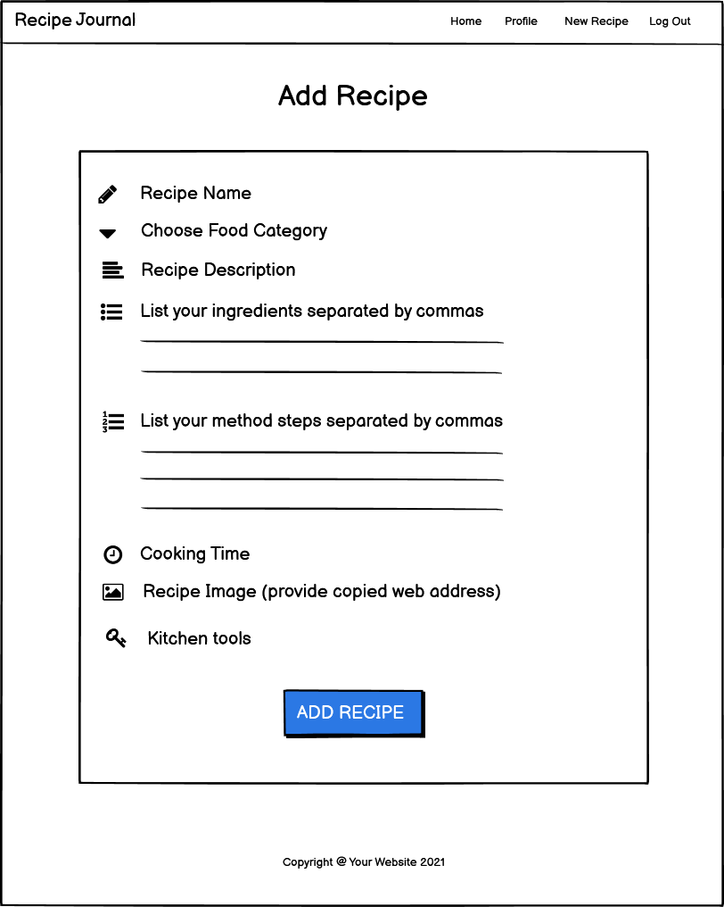
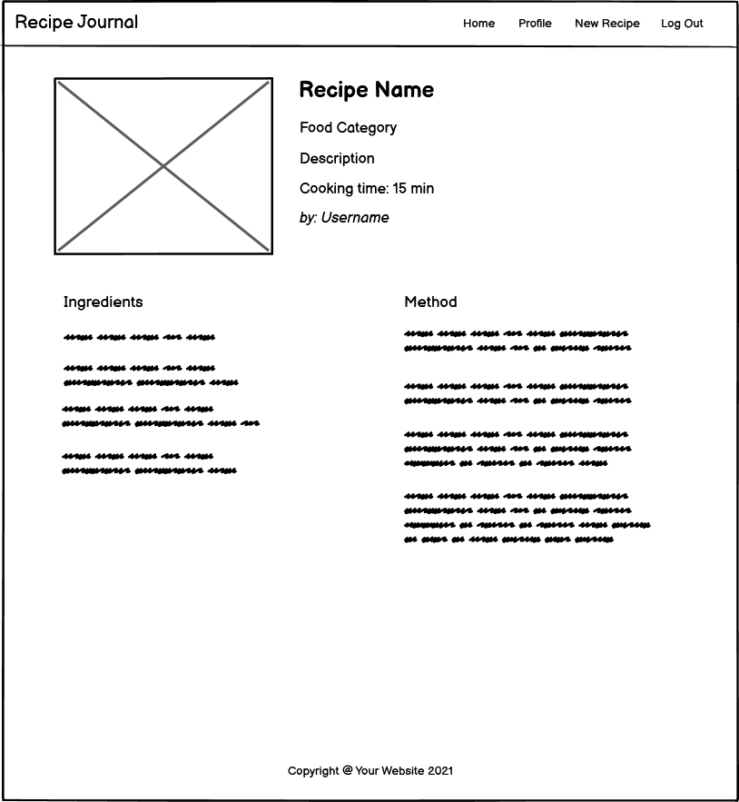

# **Recipe Journal App**
[View the live project here.](https://recipe-journal-project.herokuapp.com/)

This is the main marketing website for Admin to promote a brand of cooking tools.

## **User Experience (UX)**
* ### **User stories**
    * **First Time Visitor Goals**
        * As a new visitor, I want to easily understand the purpose of website and see an image, which represents it.
        * As a new visitor to the website, I want to easily navigate throughout the site to find the content.
        * As a new visitor, I want to register on site and be a member of community.
        * As a new visitor, I'd like to be able to add and share recipes.

    * **Returning Visitor Goals**
        * As a returning visitor, I wish to correct my recipes and delete them.
        * As a returning visitor, I wish to search for certain recipes.
        * As a returning visitor, I wish to find some tips about cooking tools.

       
* ### **Design**
    * **Colour Scheme**
        - Two colours used for the site- primary colour is teal, secondary is dark-orange.
        
    * **Typography**
        - Lato font was used throughout all website with Sans Serif as the fallback font in case chosen fond is not imported correctly. Lato looks attractive and easy to read.
        
    * **Imagery**
        - The large warm background image is designed to catch the user's eye.

* ### **Wireframes**
    * **Home Page** 
    

    * **All Recipes Page** 
    

    * **Add Recipe Page** 
    

    * **Recipe Detail Page** 
    
## **Features**
* **Responsive on all device sizes**
* **Interactive elements**
## **Technologies Used**
### **Languages Used**
* [HTML5](https://en.wikipedia.org/wiki/HTML5)
* [CSS3](https://en.wikipedia.org/wiki/CSS)
* [JavaScript](https://en.wikipedia.org/wiki/JavaScript)
* [Python](https://wiki.python.org/moin/)
### **Frameworks, Libraries & Programs Used**
1. [Balsamiq](https://balsamiq.com/)
    - Balsamiq was used to design wireframes.
2. [Materialize](https://materializecss.com/)
    - Materialize was used to create responsive, stylish website and to navigate it easly.
3. [Google Fonts](https://fonts.google.com/)
    - Google Fonts were used to import chosen fonts into css file.
4. [Font Awesome](https://fontawesome.com/)
    - Font Awesome was used to import vector and social icons for style and identification purposes.
5. [Git](https://git-scm.com/)
    - Git was used as a version-control system for coding, tracking changes, commit to Git and push to GitHub.
6. [GitHub](https://github.com/)
    - GitHub was used to store all project code with everyday changes.
7. [jQuery](https://jquery.com/)
    - jQuery was used with Materialize to make the navbar and other components responsive but was also used for the smooth scroll function in JavaScript.
7. [Heroku](https://heroku.com/)
    - Heroku platform was used to deploy, run, and operate app entirely in the cloud.
7. [MongoDB](https://www.mongodb.com/)
    - MongoDB was used to keep the project data with easily CRUD access.
## **Testing**
- W3C Markup Validator

- W3C CSS Validator

- Lighthouse report

### **Testing User Stories from User Experience (UX) Section**
* **First Time Visitor Goals**
    
* **Returning Visitor Goals**

### **Further Testing**
### **Known Bugs**
## **Deployment**
### **Heroku**

## **Credits**
### **Code**

### **Content**

### **Media**

### **Acknowledgements**
