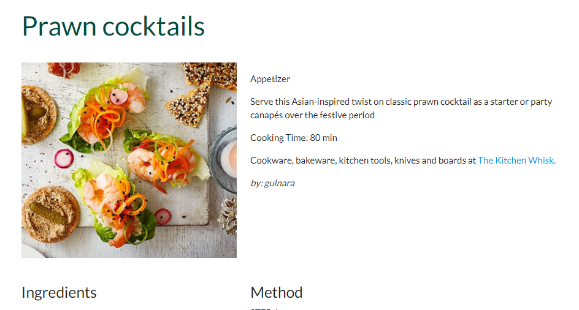

# **Recipe Journal App**
[View the live project here.](https://recipe-journal-project.herokuapp.com/)

This is a community app for sharing recipes and for owner to promote their e-commerce website with kitchen tools for sale.

## **User Experience (UX)**
* ### **User stories**
    * **First Time Visitor Goals**
        * As a new visitor, I want to easily understand the purpose of website and see an image, which represents it.
        * As a new visitor to the website, I want to easily navigate throughout the site to find the content.
        * As a new visitor, I want to register on site and be a member of community.
        * As a new visitor, I'd like to be able to add and share recipes.

    * **Returning Visitor Goals**
        * As a returning visitor, I wish to correct my recipes and delete them.
        * As a returning visitor, I wish to search for certain recipes.
        * As a returning visitor, I wish to find some tips about kitchen tools.

       
* ### **Design**
    * **Colour Scheme**
        - Two colours used for the site- primary colour is teal, secondary is dark-orange.
        
    * **Typography**
        - The Lato and Architects Daughter fonts were used at website with Sans Serif and cursive as the fallback fonts accordingly, in case chosen fonds are not imported correctly. The Lato is the main font, Architects Daughter was used for Hero image text. Both of chosen fonts look attractive and easy to read.
    * **Imagery**
        - The large warm background image is designed to catch the user's eye.

* ### **Wireframes**
    * **Home Page** 
    

    * **All Recipes Page** 
    

    * **Add Recipe Page** 
    

    * **Recipe Detail Page** 
    
## **Features**
* **Responsive on all device sizes**
* **Interactive elements**
* **Notification system**
* **Persistent storage: create, read, update and delete.**
* **Security**
* **Search options**
* **Simplicity**
* **Good image resolution**
* **Speed**
* **Flexibility**

## **Technologies Used**
### **Languages Used**
* [HTML5](https://en.wikipedia.org/wiki/HTML5)
* [CSS3](https://en.wikipedia.org/wiki/CSS)
* [JavaScript](https://en.wikipedia.org/wiki/JavaScript)
* [Python](https://wiki.python.org/moin/)
### **Frameworks, Libraries & Programs Used**
1. [Balsamiq](https://balsamiq.com/)
    - Balsamiq was used to design wireframes.
2. [Materialize](https://materializecss.com/)
    - Materialize was used to create responsive, stylish website and to navigate it easly.
3. [Google Fonts](https://fonts.google.com/)
    - Google Fonts were used to import chosen fonts into css file.
4. [Font Awesome](https://fontawesome.com/)
    - Font Awesome was used to import vector and social icons for style and identification purposes.
5. [Git](https://git-scm.com/)
    - Git was used as a version-control system for coding, tracking changes, commit to Git and push to GitHub.
6. [GitHub](https://github.com/)
    - GitHub was used to store all project code with everyday changes.
7. [jQuery](https://jquery.com/)
    - jQuery was used with Materialize to make the navbar and other components responsive but was also used for the smooth scroll function in JavaScript.
7. [Heroku](https://heroku.com/)
    - Heroku platform was used to deploy, run, and operate app entirely in the cloud.
7. [MongoDB](https://www.mongodb.com/)
    - MongoDB was used to keep the project data with easily CRUD access.
## **Testing**
- W3C Markup Validator

- W3C CSS Validator

- Lighthouse report

### **Testing User Stories from User Experience (UX) Section**
* **First Time Visitor Goals**
    * As a new visitor, I want to easily understand the purpose of a website and see an image, which represents it.
        - Upon entering the site, a new visitor greeted with a Journal name and an easily readable navigation bar with the links to other pages. Underneath there is a large Hero Image with a text that represents what a site is offer. Under the image, a new visitor can find some resently added recipes.
    * As a new visitor to the website, I want to easily navigate throughout the site to find the content.
        - A new visitor can observe, on the top of the page, a navigation bar with the links, which clearly describe the content of the pages.
        - Every recipe looks as a card with an image and some text. Click on, and a full recipe will be shown.
        - Footer also have the links to other pages.
    * As a new visitor, I want to register on the app and be a member of community.
        - Registration is straight forward. A new visitor could go to Register page, fill the form with username and password, and submit it.

        

    * As a new visitor, I'd like to be able to add and share recipes.
        - To add a recipe, a registered user should go to New Recipe page, fill the form and submit it.

        

* **Returning Visitor Goals**
    * As a returning visitor, I wish to correct my recipes and delete them.
        - To edit a recipe, returning visitor should go to a full recipe page. Then click on Edit button, fill/edit/correct the form and submit it.

        

        - To delete a recipe, returning visitor should press a Delete button on a full recipe page. The modal popup will ask one more time if the recipe should be deleted. Press No if don't or YES if delete the recipe.

        

    * As a returning visitor, I wish to search for certain recipes.
        - Search bar can be found on Recipes page under navigation bar. The search could be done by recipe name, food category and ingredients.

        

    * As a returning visitor, I wish to find some tips about kitchen tools. 
        - Every recipe contains the advertisement link to website which sales kitchen tools.

        

### **Further Testing**
- Tests were done on Google Chrome, inspecting how the site looks on various devises: desktop, laptop, iPad and the range of mobile phones.
- Many tests were done on adding, editing, deleting and searching recipes.
- The test for CRUD was done on my Galaxy S10. App operates easily and fast. 
### **Known Bugs**
- The main issue come up on Editor when someone clicks on a recipe, which not created by them.

Jinja template with if statement not show Edit and Delete buttons if it not session user's recipe. Java script cannot see needed id and gives an error.

- When small image is upload, recipe card looks different:

Large image looks fine on all devises, except i-Pad:

- Search-bar buttons sit on top of each other in i-Pad and i-Phone.

Margin top of 5px was added to give some space between them.

## **Deployment**
### **Heroku**
- Before I build my Heroku application, I create some files as requirements.txt, Procfile that Heroku needs to run the app.
    - pip3 freeze --local > requirements.txt
    - echo web: python app.py > Procfile
- Log in on my Heroku dashboard and click
to 'Create a New App'.
- Give a unique name to my project, select the closest region(Europe) and click 'Create App'.
- To connect my app, I setup Automatic Deployment from my GitHub repository:
    - Click on GitHub icon. When my profile was displayed, add my repository name, then click 'Search'.
    - Before I click to Enable Automatic Deployment:
        - Click on the 'Settings' tab for my app 
        - Click on 'Reveal Config Vars'
        - Add IP with value of 0.0.0.0
        - Add PORT, which is 5000
        - Add SECRET_KEY with value that copied from env.py file
        - Add MONGO_URI string
        - Back to terminal and add/commit/push requirements.txt and Procfile to GitHub.
    - Head back over to Heroku, click on 'Enable Automatic Deployment'.
    - I have only the master branch for the project, so click 'Deploy Branch'.
    - Heroku will now receive the code from GitHub, and start building the app using a required
packages.
    - After a few minutes the message shown "Your app
was successfully deployed."

## **Credits**
### **Code**
- My project based on Task Management Tutorial. Python, JavaScript, CSS and HTML code was taken from it and changed for my app needs.
- Materialize HTML, CSS and JavaScript code was used for a modern responsive front-end.
- A modal popup HTML, CSS and JavaScript code was taken from [W3schools](https://www.w3schools.com/howto/howto_css_modals.asp) and change a bit. 

### **Content**
- Quote "Eat what makes you happy" were taken from [web card](https://media-cdn.tripadvisor.com/media/photo-s/0f/70/ac/84/eat-what-makes-you-happy.jpg).
- Footer text from [here](https://www.dvo.com/newsletter/weekly/2018/9-28-369/cooknart10.html) and [here](https://www.saymmm.com/sharemmm.php).
### **Media**
- The Front Page Image were obtained from [Unsplash.com](https://unsplash.com/photos/Orz90t6o0e4).
### **Acknowledgements**
- My Mentor for continuous helpful feedback, ideas and support.
- Tutor support at Code Institute for their support.
